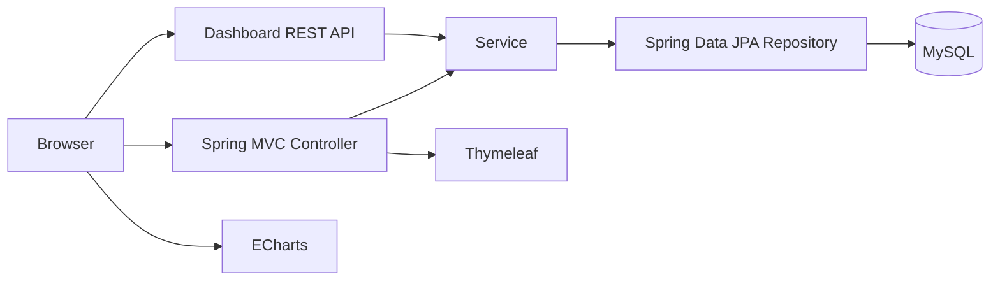

# 企業OAシステム


Spring Boot、Thymeleaf、MySQLで開発した、企業向けOA業務管理システムです。

ログイン、従業員情報管理、経営ダッシュボードを中心に、社内業務を一つの画面から確認・管理できる構成を目指しています。

> このリポジトリは、Spring BootとWebアプリケーション開発を学ぶための個人制作プロジェクトです。

## 主な機能

### ログイン

- MySQLに登録されたユーザー情報によるログイン
- HTTPセッションを利用したログイン状態の保持
- ログインユーザーの氏名表示
- ログアウト処理

### 経営ダッシュボード

- 累計売上高、受注件数、新規顧客数、登録ユーザー数の表示
- 月別売上・受注推移
- 部門別売上構成
- 月別の受注件数・新規顧客数
- MySQLのデータをREST APIから取得し、EChartsで可視化

### 従業員情報管理

- 従業員一覧の表示
- 氏名、部署、役割によるリアルタイム検索
- 従業員アカウントの新規登録
- 部署、役割、アカウント状態の表示

## システム構成



## 使用技術

| 分類 | 技術 |
| --- | --- |
| 言語 | Java 25、HTML、CSS、JavaScript |
| フレームワーク | Spring Boot 4.1.1、Spring MVC |
| テンプレート | Thymeleaf |
| データアクセス | Spring Data JPA、Hibernate |
| データベース | MySQL 8.x |
| グラフ | Apache ECharts 6 |
| ビルド | Maven Wrapper |
| 開発環境 | Eclipse / Spring Tools |

## ディレクトリ構成

```text
src/main/java/com/example/demo/
├─ controller/     Web画面とREST API
├─ service/        業務ロジック
├─ repository/     JPAリポジトリ
├─ entity/         データベースエンティティ
└─ config/         Web設定

src/main/resources/
├─ templates/      Thymeleaf画面
├─ static/css/     画面スタイル
└─ application-example.properties
```

## セットアップ

### 1. リポジトリを取得

```bash
git clone https://github.com/Limbolimbs/OASystem_wu.git
cd OASystem_wu
```

### 2. データベースを作成

MySQLで次のデータベースを作成します。

```sql
CREATE DATABASE oa_system
  CHARACTER SET utf8mb4
  COLLATE utf8mb4_unicode_ci;
```

テーブルは、初回起動時にHibernateによって作成・更新されます。

### 3. ローカル設定ファイルを作成

Windows PowerShellの場合：

```powershell
Copy-Item src/main/resources/application-example.properties `
  src/main/resources/application.properties
```

作成した `application.properties` の次の項目を、自分のMySQL環境に合わせて変更してください。

```properties
spring.datasource.username=root
spring.datasource.password=your_mysql_password
```

`application.properties` はGitの管理対象外です。パスワードや秘密情報をコミットしないでください。

### 4. アプリケーションを起動

Windows：

```powershell
.\mvnw.cmd spring-boot:run
```

macOS / Linux：

```bash
./mvnw spring-boot:run
```

起動後、ブラウザで [http://localhost:8080](http://localhost:8080) を開きます。

## 主なURL

| URL | 内容 |
| --- | --- |
| `/` | ログイン画面 |
| `/home` | 経営ダッシュボード |
| `/users` | 従業員一覧 |
| `/users/new` | 従業員新規登録 |
| `/api/dashboard` | ダッシュボードデータAPI |

## データベーステーブル

| テーブル | 内容 |
| --- | --- |
| `sys_user` | ログイン・従業員情報 |
| `sales_data` | 月別・部門別の売上、受注、顧客データ |

ダッシュボードのグラフを表示するには、`sales_data` テーブルにデータを登録してください。

## 今後の実装予定

- ログインインターセプターの有効化
- 休暇申請・承認機能
- お知らせ管理機能
- 従業員情報の編集・削除
- Spring Securityの導入
- パスワードのハッシュ化
- 入力値検証とエラーメッセージの強化

## 注意事項

現在は学習用の実装です。本番環境で利用する場合は、Spring Security、パスワードハッシュ、権限制御、CSRF対策などを追加してください。
